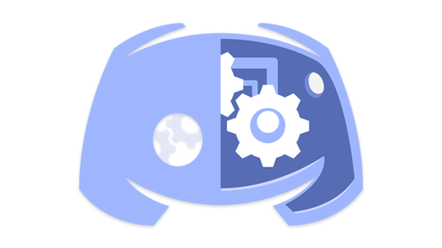
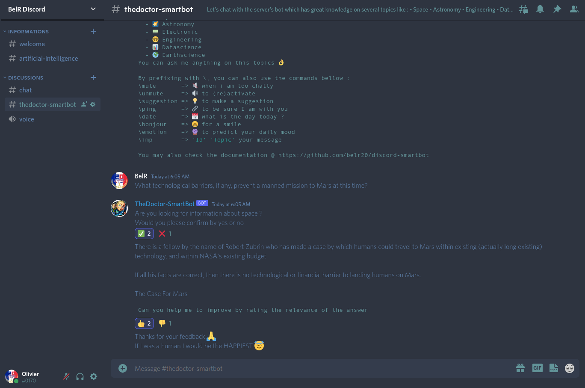

<div align="center">

  
  <h1>Discord Smart BOT</h1>
  <p>
    by
    <a href="https://github.com/belr20">BelR</a>
    with
  </p>
  
<!-- Badges -->
<p>
  <a href="https://www.python.org/downloads/release/python-3814/">
    
  </a>
  <a href="https://github.com/carloscuesta/gitmoji">
    
  </a>
  <a href="https://github.com/belr20/discord-smartbot/graphs/contributors">
    
  </a>
  <a href="">
    
  </a>
  <a href="https://github.com/belr20/discord-smartbot/network/members">
    
  </a>
  <a href="https://github.com/belr20/discord-smartbot/stargazers">
    
  </a>
  <a href="https://github.com/belr20/discord-smartbot/issues/">
    
  </a>
  <a href="http://www.wtfpl.net/about/">
    
  </a>
</p>
   
<h4>
    <a href="https://github.com/belr20/discord-smartbot/">View Demo</a>
  <span> · </span>
    <a href="https://github.com/belr20/discord-smartbot">Documentation</a>
  <span> · </span>
    <a href="https://github.com/belr20/discord-smartbot/issues/">Report Bug</a>
  <span> · </span>
    <a href="https://github.com/belr20/discord-smartbot/issues/">Request Feature</a>
  </h4>
</div>

<br />

<!-- Table of Contents -->
# :notebook_with_decorative_cover: Table of Contents

- [About the Project](#star2-about-the-project)
  * [Screenshots](#camera-screenshots)
  * [Tech Stack](#space_invader-tech-stack)
  * [Features](#dart-features)
  * [Environment Variables](#key-environment-variables)
- [Getting Started](#toolbox-getting-started)
  * [Prerequisites](#bangbang-prerequisites)
  * [Run Locally](#running-run-locally)
  * [Running Tests](#test_tube-running-tests)
  * [Deployment](#triangular_flag_on_post-deployment)
- [Usage](#eyes-usage)
  * [BOT Account Creation](#robot-bot_account_creation)
  * [Dataset creation](#card_file_box-dataset_creation)
- [Roadmap](#compass-roadmap)
- [Contributing](#wave-contributing)
- [License](#warning-license)
- [Contact](#handshake-contact)
- [Acknowledgements](#gem-acknowledgements)


<!-- About the Project -->
## :star2: About the Project

Initially, this project was created by the Stark Agency from [SIMPLON.co](https://simplon.co/) during a BOT DEV challenge, brief available [here](assets/docs/discord_chatbot_challenge_brief.pdf).  
Now I maintain this repository for my personal Discord server in which you are welcome to join by following this [link](https://discord.gg/ksVrgXGj82) :pray:  
You will have great discussion with your BOT & you will be able to challenge it on any topic of your choice, downloadable @ [stackexchange](https://archive.org/download/stackexchange).

<!-- Screenshots -->
### :camera: Screenshots

<div align="center"> 
  
</div>


<!-- TechStack -->
### :space_invader: Tech Stack

<details>
<summary>Database</summary>
  <ul>
    <li><a href="https://www.mysql.com/">MySQL</a></li>
    <li><a href="https://www.mongodb.com/">MongoDB</a></li>
  </ul>
</details>

<details>
<summary>DevOps</summary>
  <ul>
    <li><a href="https://www.docker.com/">Docker</a></li>
  </ul>
</details>

<!-- Features -->
### :dart: Features

- Discord Conversational Agent ([discord.py](https://pypi.org/project/discord.py/), [nltk](https://www.nltk.org/), [ChatterBot](https://pypi.org/project/ChatterBot/))
- Machine Learning Recommender ([scikit-learn](https://pypi.org/project/scikit-learn/), [mongo search engine](https://www.mongodb.com/docs/manual/text-search/))
- Natural Language Processing for emotion detection ([emotions-wheel](https://github.com/belr20/dev-ia-simplon/tree/main/RNCP34757E2/emotions-wheel))

<!-- Env Variables -->
### :key: Environment Variables

To run this project, you will need to add the following environment variables to your `.env` file :

`DB_USER` `DB_PASSWD` `DB_HOST` `DB_PORT` `DB_NAME` `BOT_NAME` `TOKEN` `DISCORD_CHANNEL`

Copy/paste, rename & fill in `.env.example` file.

<!-- Getting Started -->
## 	:toolbox: Getting Started

<!-- Prerequisites -->
### :bangbang: Prerequisites

This project uses Python with Pip as package manager & MongoDB with Docker as DBMS

* [ ] [Downloading & installing Python](https://wiki.python.org/moin/BeginnersGuide/Download)
* [ ] [Containerize MongoDB & Mongo Express using Docker Containers](https://devops.tutorials24x7.com/blog/containerize-mongodb-and-mongo-express-using-docker-containers)

This project needs of course a Discord server with a BOT connected to its API

* [ ] [Discord DEV Portal Documentation](https://discord.com/developers/docs/intro)

<!-- Run Locally -->
### :running: Run Locally

Clone the repository (help [here](https://docs.github.com/en/repositories/creating-and-managing-repositories/cloning-a-repository))

```bash
git clone https://github.com/belr20/discord-smartbot.git
```

Go to the project directory

```bash
cd discord-smartbot
```

Install dependencies in a recommended [virtual environment](https://docs.python.org/3/library/venv.html)

```bash
python -m venv venv
source venv/bin/activate
python -m pip install --upgrade pip wheel setuptools
python -m pip install -r requirements.txt
```


AFTER MongoDB has been populated (see Usage section below) start the BOT

```bash
python -m bot.app
```


<!-- Running Tests -->
### :test_tube: Running Tests

TBD


<!-- Deployment -->
### :triangular_flag_on_post: Deployment

To deploy this project run

```bash
deploy.sh
```

It will :
- Start MongoDB server
- Create & install all dependencies in `venv`
- Populate MongoDB with `database/stackexchange` content
- Train the topic classifier & create file `models/topic_classifier.pickle`
- Start the BOT


<!-- Usage -->
## :eyes: Usage


<!-- BOT Account creation -->
### :robot: BOT Account creation

* [ ] Make sure the DEV option is enabled in your Discord profile
* [ ] Go to the [Discord DEV Portal](https://discord.com/developers/applications)
* [ ] Follow this [wonderfull tutorial](https://www.youtube.com/watch?v=ibtXXoMxaho) to connect the BOT to the API
* [ ] Save the token (client secret) & add it to your `.env` file in `TOKEN`

> `TOKEN` will be passed to [`discord.Client.run`](https://discordpy.readthedocs.io/en/latest/api.html#discord.Client.run) instance at run time  
> Cf. `bot/app.py:458`  


<!-- Dataset creation -->
### :card_file_box: Dataset creation

* [ ] Download topics of your choice @ [stackexchange](https://archive.org/download/stackexchange)
* [ ] Unzip archive files to `database/stackexchange` & rename folders as desired (folder_name=topic_name) like :

```
discord-smartbot
│   README.md
│   deploy.sh
│
└───database
│   │   create_db.py
│   │
│   └───stackexchange
│       │
│       └───datascience
│       │   └───Posts.xml
│       └───general
│           └───Posts.xml
└───bot
    │   app.py
    │   messages.py
```

* [ ] Go to `database` & populate MongoDB with stackexchange dataset

```bash
cd database
python create_db.py
```

* [ ] Go to `models` & train classifier on dataset

```bash
cd models
python create_topic_classifier.py
```

The BOT is now ready to answer your questions :thumbs_up:


<!-- Roadmap -->
## :compass: Roadmap

* [x] Transfer from Stark Agency to BelR's Discord server
* [ ] Add [MotoGP](https://www.motogp.com/fr) topic :v:


<!-- Contributing -->
## :wave: Contributing

<a href="https://github.com/belr20/discord-smartbot/graphs/contributors">
  
</a>

Contributions are always welcome!


<!-- Acknowledgments -->
## :gem: Acknowledgements

 - [ChatterBot Tutorial](https://chatterbot.readthedocs.io/en/stable/tutorial.html)
 - [Discord DEV Portal Documentation](https://discord.com/developers/docs/intro)
 - [How to build your own AI Chatbot on Discord](https://towardsdatascience.com/how-to-build-your-own-ai-chatbot-on-discord-c6b3468189f4)
 - [Build Your First Chatbot Using Python & NLTK](https://www.kdnuggets.com/2019/05/build-chatbot-python-nltk.html)
 - [Containerize MongoDB and Mongo Express using Docker Containers](https://devops.tutorials24x7.com/blog/containerize-mongodb-and-mongo-express-using-docker-containers)
 - [Database schema documentation for the public stackexchange data dump](https://meta.stackexchange.com/questions/2677/database-schema-documentation-for-the-public-data-dump-and-sede)

<br>

 - [Cloning a repository](https://docs.github.com/en/repositories/creating-and-managing-repositories/cloning-a-repository)
 - [Downloading & installing Python](https://wiki.python.org/moin/BeginnersGuide/Download)
 - [Creation of Python virtual environments](https://docs.python.org/3/library/venv.html)
 - [Discord Bots | Discord Dev Portal | YouTube](https://www.youtube.com/watch?v=ibtXXoMxaho)
 - [Creating a BOT account in Discord DEV Portal](https://discordpy.readthedocs.io/en/latest/discord.html)
 
 <br>

 - [gitmoji](https://github.com/carloscuesta/gitmoji)
 - [Shields.io](https://shields.io/)
 - [Emoji Cheat Sheet](https://github.com/ikatyang/emoji-cheat-sheet/blob/master/README.md#travel--places)
 - [Awesome Readme Template](https://github.com/Louis3797/awesome-readme-template)


<!-- License -->
## :warning: License

Distributed under the WTFPL License.


<!-- Contact -->
## :handshake: Contact

[BelR](https://github.com/belr20)

Project Link: [https://github.com/belr20/discord-smartbot](https://github.com/belr20/discord-smartbot)
